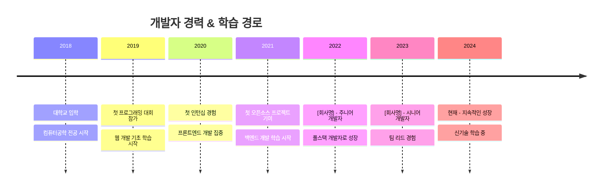

# 🚀 개발자 포트폴리오

  
  
  
  

 

## ✨ 소개

> "여기에 자신을 한 줄로 표현하는 문구를 넣으세요"

안녕하세요! 저는 [이름]입니다. [간단한 자기소개를 2-3문장으로 작성하세요]

### 🌟 핵심 역량
- 💻 [주요 역량 1]
- 🔍 [주요 역량 2]
- 🚀 [주요 역량 3]

 

## 🛠️ 기술 스택

  <h3>💫 Languages</h3>
  
  
  
  
  <!-- 더 많은 언어 추가 가능 -->
  
  <h3>🔥 Frontend</h3>
  
  
  
  
  
  <!-- 더 많은 프론트엔드 기술 추가 가능 -->
  
  <h3>⚙️ Backend</h3>
  
  
  
  
  
  <!-- 더 많은 백엔드 기술 추가 가능 -->
  
  <h3>🗄️ Database</h3>
  
  
  
  
  <!-- 더 많은 데이터베이스 기술 추가 가능 -->
  
  <h3>🔧 DevOps & Tools</h3>
  
  
  
  
  
  <!-- 더 많은 도구 추가 가능 -->

 

## 📊 GitHub 통계

  
    
  
  

    
    
  

   
  
  

 

## 🏆 주요 프로젝트

  <table>
    <tr>
      <td width="50%">
        <h3 align="center">프로젝트 1</h3>
        

          
          

            
            
          

          
<strong>사용 기술:</strong> React, Node.js, MongoDB, AWS

          

            프로젝트에 대한 간략한 설명을 여기에 작성하세요. 어떤 문제를 해결했는지, 어떤 기술을 사용했는지 등을 포함하세요.
          

        

      </td>
      <td width="50%">
        <h3 align="center">프로젝트 2</h3>
        

          
          

            
            
          

          
<strong>사용 기술:</strong> Vue.js, Express, PostgreSQL, Docker

          

            프로젝트에 대한 간략한 설명을 여기에 작성하세요. 어떤 문제를 해결했는지, 어떤 기술을 사용했는지 등을 포함하세요.
          

        

      </td>
    </tr>
    <tr>
      <td width="50%">
        <h3 align="center">프로젝트 3</h3>
        

          
          

            
            
          

          
<strong>사용 기술:</strong> Angular, Django, MySQL, Kubernetes

          

            프로젝트에 대한 간략한 설명을 여기에 작성하세요. 어떤 문제를 해결했는지, 어떤 기술을 사용했는지 등을 포함하세요.
          

        

      </td>
      <td width="50%">
        <h3 align="center">프로젝트 4</h3>
        

          
          

            
            
          

          
<strong>사용 기술:</strong> React Native, Firebase, GraphQL

          

            프로젝트에 대한 간략한 설명을 여기에 작성하세요. 어떤 문제를 해결했는지, 어떤 기술을 사용했는지 등을 포함하세요.
          

        

      </td>
    </tr>
  </table>

 

## 📈 경력 타임라인

 

## 🎓 교육 및 자격증

  <table>
    <tr>
      <th>학위/자격증</th>
      <th>기관</th>
      <th>기간/취득일</th>
    </tr>
    <tr>
      <td>컴퓨터공학 학사</td>
      <td>XX대학교</td>
      <td>20XX - 20XX</td>
    </tr>
    <tr>
      <td>AWS 솔루션 아키텍트</td>
      <td>Amazon Web Services</td>
      <td>20XX년 X월</td>
    </tr>
    <tr>
      <td>정보처리기사</td>
      <td>한국산업인력공단</td>
      <td>20XX년 X월</td>
    </tr>
    <!-- 더 많은 학위/자격증 추가 가능 -->
  </table>

 

## 📚 기술 블로그 & 발표

  <table>
    <tr>
      <th width="20%">날짜</th>
      <th width="50%">제목</th>
      <th width="30%">링크</th>
    </tr>
    <tr>
      <td>2023-10-15</td>
      <td>React 상태 관리의 새로운 접근법</td>
      <td><a href="https://yourblog.com/react-state">📝 블로그 포스트</a></td>
    </tr>
    <tr>
      <td>2023-08-22</td>
      <td>마이크로서비스 아키텍처 구현 사례</td>
      <td><a href="https://yourblog.com/microservices">📝 블로그 포스트</a></td>
    </tr>
    <tr>
      <td>2023-06-10</td>
      <td>웹 성능 최적화 전략</td>
      <td><a href="https://youtube.com/your-talk">🎥 발표 영상</a></td>
    </tr>
    <!-- 더 많은 글/발표 추가 가능 -->
  </table>

 

## 🏅 수상 및 성과

- **20XX 해커톤 대상** - [행사명] - [프로젝트명]
- **20XX 개발 공모전 최우수상** - [주최기관] - [프로젝트명]
- **오픈소스 프로젝트 기여** - [프로젝트명] - [기여 내용 간략히]
- **특허 출원** - [특허명] - [출원번호]

 

## 📱 연락처 & 소셜 미디어

  
  
  
  
  
  

 

---

  
    
  

